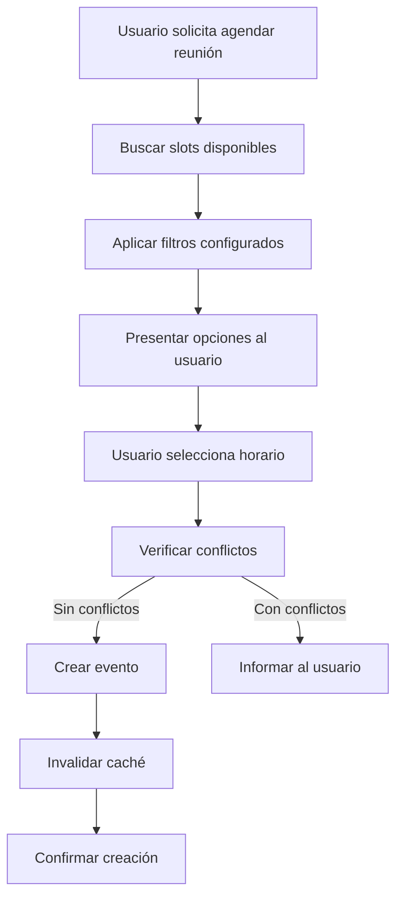

# CalendarService - Documentación

## Descripción General
`CalendarService` es un componente clave para gestionar todas las operaciones relacionadas con Google Calendar en el sistema Ublix Chat. Es un servicio especializado que encapsula toda la lógica de interacción con Google Calendar API, actuando como una capa de abstracción entre el sistema de chat y el calendario.

## Propósito Principal
Proporcionar una interfaz unificada y robusta para todas las operaciones de calendario, con manejo de errores, reintentos automáticos, y optimización mediante caché.

## Funcionalidades Principales

### 1. Búsqueda de Horarios Disponibles (`find_available_slots`)
Busca espacios libres en el calendario con múltiples opciones de filtrado.

**Parámetros:**
- `project_id`: ID del proyecto
- `user_id`: ID del usuario
- `title`: Título de búsqueda (para contexto)
- `specific_date`: Fecha específica (YYYY-MM-DD)
- `duration_hours`: Duración en horas
- `search_config`: Configuración de filtros
  - `exclude_holidays`: Excluir feriados
  - `search_weeks_ahead`: Semanas a buscar hacia adelante

**Retorna:** Lista de slots disponibles parseados

### 2. Verificación de Conflictos (`check_conflicts`)
Verifica si un horario específico tiene conflictos con eventos existentes.

**Características:**
- Utiliza sistema de caché (`conflict_cache`) para optimizar consultas
- Invalida automáticamente el caché cuando se detectan cambios
- Si no se proporciona hora de fin, asume duración de 1 hora

**Parámetros:**
- `start_time`: Hora de inicio (ISO format)
- `end_time`: Hora de fin (opcional)
- `project_id`: ID del proyecto

### 3. Gestión de Eventos

#### Crear Eventos (`create_event`)
Crea reuniones en Google Calendar con opciones avanzadas.

**Parámetros:**
- `title`: Título del evento
- `start_datetime`: Fecha/hora de inicio
- `end_datetime`: Fecha/hora de fin (opcional)
- `attendee_email`: Email del asistente
- `description`: Descripción del evento
- `include_meet`: Incluir Google Meet (default: true)
- `force_create`: Forzar creación ignorando conflictos

#### Actualizar Eventos (`update_event`)
Modifica eventos existentes preservando la integridad del calendario.

**Parámetros:**
- `event_id`: ID del evento
- `updates`: Diccionario con campos a actualizar

#### Eliminar Eventos (`delete_event`)
Elimina eventos y actualiza el caché automáticamente.

#### Obtener Información (`get_event`)
Consulta detalles específicos de un evento.

## Características Técnicas

### Sistema de Retry y Timeout
- **Timeout**: 30 segundos para operaciones complejas
- **Reintentos**: Hasta 3 intentos automáticos
- **Estrategia**: Backoff exponencial (1s, 2s, 4s)
- **Errores recuperables**: network, timeout, connection, temporarily unavailable

### Gestión de Zona Horaria
- Zona horaria predeterminada: `America/Santiago` (Chile)
- Conversiones automáticas de tiempo
- Manejo consistente de fechas/horas en todo el sistema

### Integración con el Sistema
- **Comunicación**: A través de `google_calendar_tool`
- **Contexto**: Sistema de "mock state" para pasar información del proyecto/usuario
- **Errores**: Manejo robusto con categorías y severidades (`ErrorCategory`, `ErrorSeverity`)

### Optimización de Rendimiento
- **Caché de conflictos**: Reduce consultas repetidas al calendario
- **Invalidación inteligente**: Actualización automática cuando se modifican eventos
- **Ejecución asíncrona**: Uso de `asyncio` para operaciones no bloqueantes
- **Thread safety**: Operaciones ejecutadas en threads separados cuando es necesario

## Flujo de Trabajo Típico



## Parsing de Respuestas

### Parser de Slots Disponibles (`_parse_available_slots`)
Detecta y extrae horarios disponibles de múltiples formatos:
- Formato numerado: "1. Lunes 14 De Julio De 2025 a las 09:00 horas"
- Formato simple: "Lunes 14 De Julio De 2025 a las 09:00 horas"
- Horarios directos con marcadores de tiempo (AM/PM, hrs, :)

### Parser de Eventos (`_parse_event_creation_result`)
Extrae información crítica de eventos creados:
- URLs del evento
- IDs de evento
- Enlaces de Google Meet
- Metadatos del evento

## Manejo de Errores

El servicio implementa un sistema robusto de manejo de errores:

1. **Categorización**: Errores clasificados por tipo (`ErrorCategory.CALENDAR_API`)
2. **Severidad**: Niveles HIGH, MEDIUM, LOW
3. **Códigos específicos**: 
   - `SLOTS_SEARCH_FAILED`
   - `CONFLICT_CHECK_ERROR`
   - `GET_EVENT_ERROR`
   - `CALENDAR_TIMEOUT_ERROR`

## Mejores Prácticas de Uso

1. **Siempre proporcionar `project_id`** para mantener la segregación de datos
2. **Usar `search_config`** para optimizar búsquedas de slots
3. **Manejar respuestas asíncronas** apropiadamente
4. **Verificar conflictos** antes de crear eventos importantes
5. **Incluir descripciones detalladas** en eventos para mejor contexto

## Ejemplo de Uso

```python
# Instanciar el servicio
calendar_service = CalendarService()

# Buscar horarios disponibles
slots = await calendar_service.find_available_slots(
    project_id="proj_123",
    user_id="user_456",
    title="Reunión de seguimiento",
    specific_date="2025-01-20",
    duration_hours=1,
    search_config={
        'exclude_holidays': True,
        'exclude_weekends': True,
        'search_weeks_ahead': 2
    }
)

# Crear evento
result = await calendar_service.create_event(
    title="Reunión de seguimiento",
    start_datetime="2025-01-20T10:00:00",
    end_datetime="2025-01-20T11:00:00",
    attendee_email="cliente@ejemplo.com",
    description="Reunión para revisar avances del proyecto",
    include_meet=True,
    project_id="proj_123"
)
```

## Dependencias Clave

- `asyncio`: Para operaciones asíncronas
- `pytz`: Manejo de zonas horarias
- `google_calendar_tool`: Herramienta base para interactuar con Google Calendar
- `conflict_cache`: Sistema de caché para optimización
- `error_handler`: Manejo centralizado de errores

## Logging

El servicio implementa logging detallado para debugging:
- Información sobre slots parseados
- Advertencias sobre timeouts y reintentos
- Errores con contexto completo
- Métricas de rendimiento de operaciones

## Consideraciones de Seguridad

1. **Validación de entrada**: Todos los parámetros son validados
2. **Sanitización de URLs**: Expresiones regulares para extraer URLs seguras
3. **Control de acceso**: Basado en `project_id` y contexto de usuario
4. **Sin exposición de credenciales**: Las credenciales de Google Calendar se manejan en la capa inferior